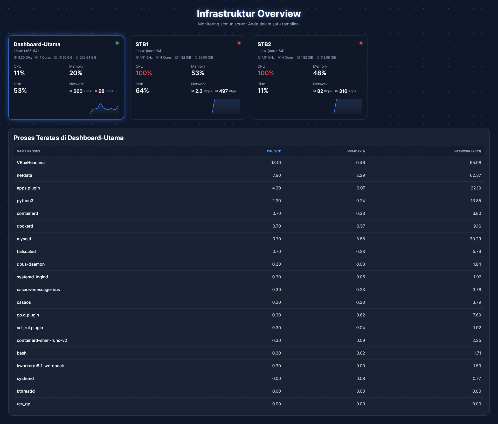

# Lightweight Multi-Server Monitoring Dashboard

<p align="center">
  
</p>

<p align="center">
  A simple yet powerful multi-server monitoring tool with a real-time web dashboard. Built with a parent-child architecture, it allows you to monitor the vital stats of multiple machines from a single, clean interface.
</p>

<p align="center">
  <a href="#key-features">Key Features</a> •
  <a href="#tech-stack">Tech Stack</a> •
  <a href="#getting-started">Getting Started</a> •
  <a href="#configuration">Configuration</a> •
  <a href="#usage">Usage</a>
</p>

---

## ✨ Key Features

* **Parent-Child Architecture**: Monitor multiple child agents from a single parent server.
* **Real-time Monitoring**: Tracks vital metrics including CPU, Memory, Disk usage, and Network speed (upload/download).
* **Web-Based Dashboard**: A clean and responsive UI built with Tailwind CSS and ApexCharts.js.
* **Persistent Server List**: Uses SQLite to remember servers, even if they go offline. Their last known state is preserved.
* **Token-Based Identification**: Each child agent is identified by a unique token, preventing duplicates if a hostname changes.
* **Live Process List**: Click on any online server to view its top running processes sorted by resource usage.
* **Visual Status Indicators**:
    * 🟢 **Green**: CPU load is normal.
    * 🟡 **Yellow**: CPU load is high ( > 60%).
    * 🔴 **Red**: CPU load is critical ( > 85%).
    * ⚫ **Gray**: Server is offline.

---

## ⚙️ Tech Stack

This project is built with a combination of robust and lightweight technologies:

* **Backend**: Python, Flask, Psutil, Flask-CORS
* **Frontend**: HTML5, Tailwind CSS, ApexCharts.js
* **Database**: SQLite (built-in with Python)

---

## 🚀 Getting Started

Follow these instructions to get the monitoring system up and running.

### Prerequisites

* Python 3.7 or higher
* `pip` package manager

### 1. Parent Server Setup

The Parent is the central server that displays the dashboard. Set this up on your main machine.

1.  **Clone the Repository (or Download Files)**
    ```bash
    git clone https://github.com/bayusegara27/simple-monitor.git
    cd simple-monitor
    ```

2.  **Create a Virtual Environment (Recommended)**
    ```bash
    # For Linux/macOS
    python3 -m venv venv
    source venv/bin/activate

    # For Windows
    python -m venv venv
    venv\Scripts\activate
    ```

3.  **Install Dependencies**
    Install all required Python packages using the `requirements.txt` file.
    ```bash
    pip install -r requirements.txt
    ```

4.  **Configure the Parent**
    Create a file named `.env` and add the parent configuration. You can copy the content from the `env-parent.txt` example.
    ```ini
    # --- Parent Server Configuration ---
    ROLE=parent
    TOKEN=your-unique-and-secret-parent-token
    SERVER_NAME=Dashboard-Utama
    PARENT_HOST=0.0.0.0
    PARENT_PORT=8000
    ```
    * `TOKEN`: Must be a unique, secret string.
    * `PARENT_HOST`: `0.0.0.0` allows access from any machine on your network.

5.  **Run the Parent Server**
    ```bash
    python app.py
    ```
    The server is now running! You can access the dashboard at `http://<your_parent_ip>:8000`.

---

### 2. Child Agent Setup

The Child is the agent you install on every machine you want to monitor.

1.  **Copy Files**: Copy the project folder (or at least `app.py` and `requirements.txt`) to the child machine.

2.  **Follow Steps 2 & 3** from the Parent setup to create a virtual environment and install dependencies.

3.  **Configure the Child**
    On the child machine, create a file named `.env` and add the child configuration. You can copy the content from the `env-child.txt` example.
    ```ini
    # --- Child Agent Configuration ---
    ROLE=child
    TOKEN=a-unique-token-for-this-specific-child
    PARENT_URL=http://<your_parent_ip>:8000
    SERVER_NAME=My-Web-Server
    SEND_INTERVAL=2
    ```
    * `TOKEN`: Must be unique for **each child machine**. Do not reuse tokens.
    * `PARENT_URL`: Must point to the correct IP address and port of your running **Parent Server**.
    * `SERVER_NAME`: A friendly name for this machine that will appear on the dashboard.

4.  **Run the Child Agent**
    ```bash
    python app.py
    ```
    The agent will now start sending its metrics to the parent server, and it will appear on the dashboard.

---

## 🔧 Configuration

All configuration is managed through a `.env` file in the project's root directory.

#### Parent `.env` Example

```ini
ROLE=parent
TOKEN=ganti-dengan-token-unik-untuk-parent 
SERVER_NAME=Dashboard-Utama
PARENT_HOST=0.0.0.0
PARENT_PORT=8000
```
